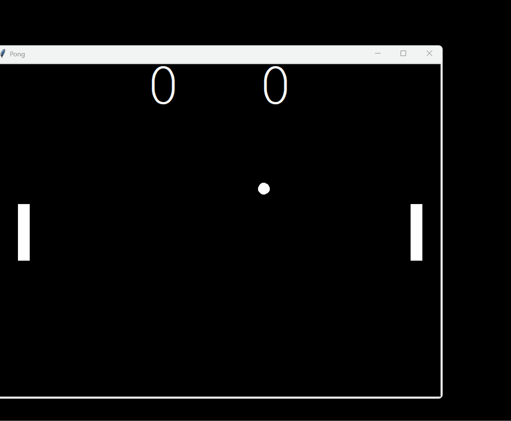

# Pong 🏓

A classic two-player Pong game built from scratch in Python using the built-in `turtle` module, with an object-oriented design.


<!-- Replace with a screenshot or GIF of gameplay. Delete this line if you don't have one yet. -->

## Features

- Two-player local multiplayer with independent paddle controls
- Realistic ball physics — reflects correctly off walls and paddles at any angle
- Ball speeds up after every paddle hit, resetting back to normal speed after each point
- Ball serves toward whichever player just lost the point
- Paddles are boundary-clamped so they can't move off-screen
- Live scoreboard tracking both players

## Project Structure

```
pong/
├── main.py          # Game loop, screen setup, collision & scoring logic
├── ball.py          # Ball class — movement, speed, bounce physics
├── paddle.py        # Paddle class — movement and boundary clamping
├── scoreboard.py     # Scoreboard class — score tracking and display
└── README.md
```

Each part of the game is handled by its own class:

- **`Ball`** and **`Paddle`** and **`Scoreboard`** all inherit directly from `Turtle`, since each is a simple, self-contained shape on screen with its own behavior.
- **`main.py`** wires everything together and owns the game loop — collision detection, scoring, and win conditions live here rather than inside the individual classes.

## How to Run

```bash
python main.py
```

No external dependencies — this project only uses Python's built-in `turtle` module.

## Controls

| Player | Up | Down |
|--------|----|------|
| Right paddle | ↑ | ↓ |
| Left paddle | W | S |

## What I Learned

- Reflecting an object off a surface using heading math (`180 - heading()` for vertical walls, `360 - heading()` for horizontal walls)
- Why floating-point/exact equality checks (`==`) are unreliable for collision detection, and how to use range-based checks instead
- Detecting collisions with a rectangle (the paddle) by checking x and y ranges separately, rather than using straight-line distance
- Avoiding repeated/stuck collision triggers by clamping position immediately after detecting a hit
- The difference between `onkey()` (fires once per press) and `onkeypress()` (fires continuously while held)
- Boundary clamping for object movement, including handling off-by-one edge cases at the exact boundary value

## Challenges & How I Solved Them

- **Challenge:** The ball would occasionally pass through the paddles instead of bouncing.
  **Solution:** Switched from checking `distance()` (which treats the paddle as a single point) to separately checking the ball's x-position against the paddle's edge and its y-position against the paddle's height range — accounting for the paddle's actual rectangular shape.

- **Challenge:** The paddle would sometimes get stuck just short of the top/bottom edge and refuse to move further.
  **Solution:** Traced through the boundary condition by hand and found a gap between strict `<` and `>` checks that never triggered exactly at the boundary value. Switching to `<=`/`>=` closed the gap.

- **Challenge:** Holding down a movement key only moved the paddle once instead of continuously.
  **Solution:** Replaced `screen.onkey()` with `screen.onkeypress()`, which is designed to fire repeatedly while a key is held.

## Possible Future Improvements

- Add a win condition at a set score (e.g. first to 5 points)
- Add sound effects for paddle hits, wall bounces, and scoring
- Randomize the serve angle slightly instead of a fixed 45°
- Add a "Game Over" screen with a restart option
